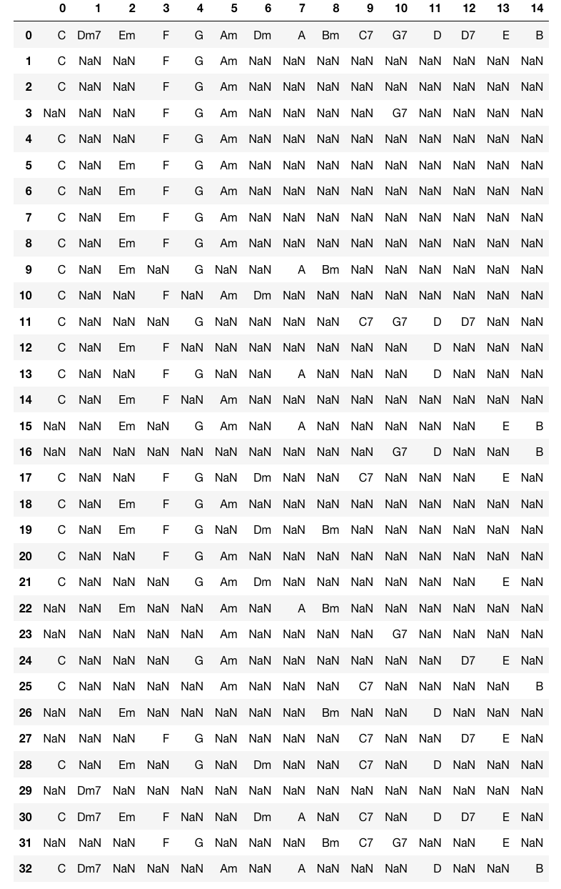
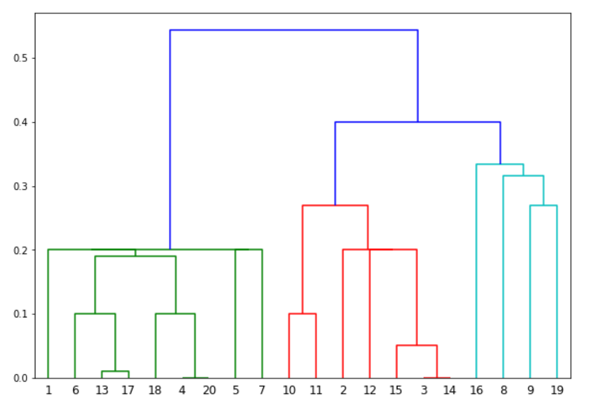
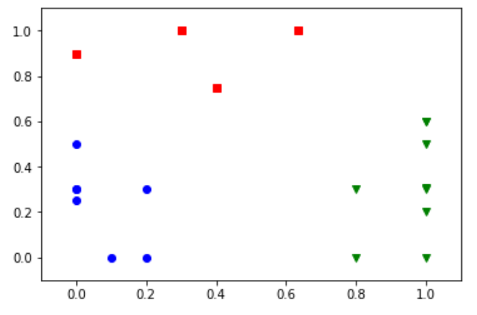

# DataBase Architecture
Hideo Daikoku 71675597

## Apriori Algorithm

#### Dataset

For this project, I decided to use [Hooktheory](www.hooktheory.com)- a website that shows how most popular songs are derived from the same set of chords. I took a list of my favorite songs and ran them through [UltimateGuitar.com](www.ultimateguitar.com). I retrieved the chords present in each song and wrote them to a csv file. I used this as my data for the Apriori Algorithm.

#### Implementation

    import numpy as np  
    import matplotlib.pyplot as plt  
    import pandas as pd  
    from apyori import apriori

    store_data = pd.read_csv('chords.csv', header=None)

    records = []  
    for i in range(0, 33):  
    records.append([str(store_data.values[i,j]) for j in range(0, 15)])
    
    association_rules = apriori(records, min_support=0.0045, min_confidence=0.2, min_lift=3, min_length=2)  
    association_results = list(association_rules)` 

    for item in association_results:
        pair = item[0] 
        items = [x for x in pair]
        print("Rule: " + items[0] + " -> " + items[1])
        print("Support: " + str(item[1]))

        print("Confidence: " + str(item[2][0][2]))
        print("Lift: " + str(item[2][0][3]))
        print("*****************************")`
 
#### Results
    Rule: Dm7 -> A
    Support: 0.09090909090909091
    Confidence: 0.42857142857142855
    Lift: 3.5357142857142856
    **********************************
    Rule: Dm7 -> B
    Support: 0.06060606060606061
    Confidence: 0.4
    Lift: 3.3000000000000003
    **********************************
    Rule: C7 -> D7
    Support: 0.12121212121212122
    Confidence: 0.5
    Lift: 3.3
    **********************************
    Rule: D7 -> Dm7
    Support: 0.06060606060606061
    Confidence: 0.4
    Lift: 3.3000000000000003
    **********************************
## Clustering

### Dataset
For this dataset I used images of orchids, and rated each orchid on two perceptual factors, preference and beauty.

### Hierarchical Clustering
#### Implementation
    from numpy import genfromtxt
    orchids = genfromtxt('imgdata.csv', delimiter=',')
    from sklearn.cluster import AgglomerativeClustering

    cluster = AgglomerativeClustering(n_clusters=2, affinity='euclidean', linkage='ward')  
    cluster.fit_predict(orchids)

    plt.scatter(orchids[:,0],orchids[:,1], c=cluster.labels_, cmap='rainbow')   
#### Results

### K-Means
#### Implementation

    from sklearn.cluster import KMeans
    from sklearn import metrics
    import numpy as np
    import matplotlib.pyplot as plt

    from numpy import genfromtxt
    orchids = genfromtxt('imgdata.csv', delimiter=',')

    x1=[]
    x2=[]
    for row in range(len(orchids)):
    x1.append(orchids[row][0])
    x2.append(orchids[row][1])
    
    plt.plot()
    plt.xlim([-0.1, 1.1])
    plt.ylim([-0.1, 1.1])
    plt.title('Dataset')
    plt.scatter(x1, x2)
    plt.show()

    plt.plot()
    X = np.array(list(zip(x1, x2))).reshape(len(x1), 2)
    colors = ['b', 'g', 'r']
    markers = ['o', 'v', 's']

    K = 3
    kmeans_model = KMeans(n_clusters=K).fit(X)

    plt.plot()
    for i, l in enumerate(kmeans_model.labels_):
        plt.plot(x1[i], x2[i], color=colors[l], marker=markers[l],ls='None')
        plt.xlim([-0.1, 1.1])
        plt.ylim([-0.1, 1.1])
        plt.show()
 

#### Results

### Comparing Hierarchical Clustering and K-Means

The k-means algorithm is dependant on the k, the number of clusters you want to create. It makes a number of assumptions about the data, assuming the data is 'spherical' and is entirely dependent on the value of k.

For hiearrchical  k-means, you don't need to specify a k parameter: once the dendogram or tree has been produced,can choose which part of the tree seems fit to you.# Apriori-Clustering
